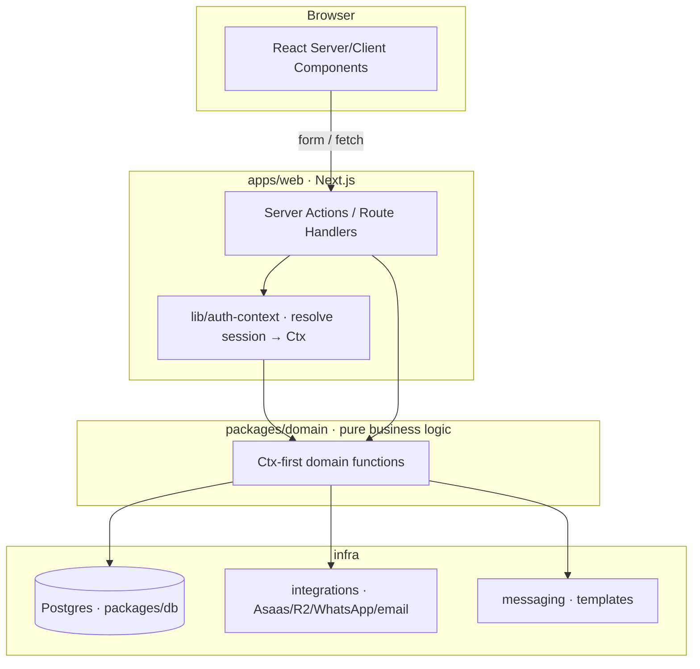

# Architecture

Living document. Explains the layers, the boundaries and the why. For the operational summary, see [`/CLAUDE.md`](../CLAUDE.md).

## Overview

TypeScript monorepo. Today frontend and backend live together in Next.js (`apps/web`), but the
**domain logic is isolated in `packages/domain`** precisely so that splitting the backend out later
is a matter of days, not months.



## The layers

### `packages/shared` — isomorphic foundation
Types, reusable Zod schemas (phone, CPF/CNPJ, slug…), prefixed ID generation, formatting utils,
error taxonomy (`DomainError`), and the `ActionResult` contract. Importable from both client and
server. Server-only env validation lives behind the `@acolhe-animal/shared/env` subpath.

### `packages/db` — data
Drizzle schema (one source of truth for tables + types), Postgres client (pool memoized on
`globalThis`), migrations and seeds. The better-auth tables (`user`, `session`, `account`,
`verification`) live here so they're included in migrations; keep them in sync with
`apps/web/lib/auth.ts`.

### `packages/domain` — the brain
Pure business functions, organized by feature (`animals/`, `people/`, `applications/`,
`adoptions/`, `organizations/`, `timeline/`, `audit/`, `auth/`). **Every function takes a `Ctx`**
and returns data or throws a `DomainError`. No Next, no HTTP, no `process.env`, no session.

The `Ctx`:
```ts
interface Ctx { db: DbExecutor; organizationId: string; actor: Actor }
type Actor =
  | { type: 'user'; userId: string; role: 'admin' | 'volunteer' }
  | { type: 'public' }
  | { type: 'system'; source: string };
```
Transactions via `withTransaction(ctx, fn)` (reuses the tx if already inside one).

### `packages/integrations` — the outside world
Each external provider has an **interface** (`StorageProvider`, `PaymentsProvider`,
`MessagingProvider`, `EmailProvider`), a **mock** adapter (default, offline) and a **live** adapter
(stub to implement). The choice is driven by `INTEGRATIONS_MODE`. The domain depends on the
interfaces, never on a concrete SDK → swapping Asaas for another fintech is an adapter change, not
a domain change.

### `packages/messaging` — communication
Versioned templates (pure functions → string). The domain renders and delivers via `integrations`.
No I/O.

### `apps/web` — delivery
Next.js App Router. RSC for reads, Server Actions for mutations, Route Handlers for webhooks.
Resolves session → `Ctx` (`lib/auth-context.ts`), maps `DomainError` → `ActionResult`
(`lib/action.ts`). Modular UI: pages composed of small, single-purpose components
(`components/ui`, `components/nav`, `components/<feature>`). UI copy is externalized via next-intl
(`messages/pt/*`).

## Why these choices (summary)
- **Ctx-first domain** instead of classes/repos: easy to read, testable (pass a fake `Ctx`), and
  decoupled from the transport. See `docs/adr/0002`.
- **Internal packages (direct source)** instead of per-package builds: less ceremony, instant HMR,
  end-to-end type safety. See `docs/adr/0001`.
- **Adapters behind interfaces** instead of calling SDKs in the domain: provider swap and offline
  tests. See `docs/adr/0003`.

## Multi-tenancy
`organizationId` on every domain table; every query filters by it in the application. The `Ctx`
carries the tenant resolved from the user's active membership. Never derive the tenant from client
input.

## Future extraction boundary
When the backend is split out: `packages/domain` + `db` + `integrations` + `messaging` become the
service; `apps/web` calls over HTTP/tRPC instead of importing directly. Because the Server Actions
are already thin (input → domain → output), the cut point is clear.

See also: [`conventions.md`](conventions.md), [`flows/`](flows/), [`adr/`](adr/).
