# Flow — adoption funnel

From the public form to a formalized adoption. See the entities in
`01-docs-referencia/modelagem-dados.md` (Application, Adoption).

```mermaid
stateDiagram-v2
  [*] --> draft: candidate starts the form (creates Person + Application)
  draft --> new: submitApplication (autosave per step; expires in 7d if abandoned)
  new --> in_progress: NGO takes it (assignApplication)
  in_progress --> approved: setApplicationStatus('approved') → animal becomes "reserved"
  in_progress --> rejected: setApplicationStatus('rejected')
  new --> withdrew: candidate gives up
  approved --> adoption: finalizeDigitalAdoption → creates Adoption, animal becomes "adopted"
  approved --> in_progress: revert → frees the animal if no other approved application
  adoption --> [*]
  rejected --> [*]
  withdrew --> [*]
```

Key points:
- **Approving reserves the animal** (in a transaction): `application.status='approved'` +
  `animal.status='reserved'`.
- **Reverting** an approval returns the animal to `available` **if** there's no other approved
  application for it.
- **Adoption is its own entity**, not a terminal state of the Application. The Application stays
  `approved`; `EXISTS(adoption WHERE application_id=…)` tells whether it became an adoption.
- **Offline**: `registerOfflineAdoption` creates a Person + Adoption with no Application (a fair/event
  adoption), attaching the scanned term.
- The candidate is notified over WhatsApp on submit and on status changes (messages in
  `@acolhe-animal/messaging`).
