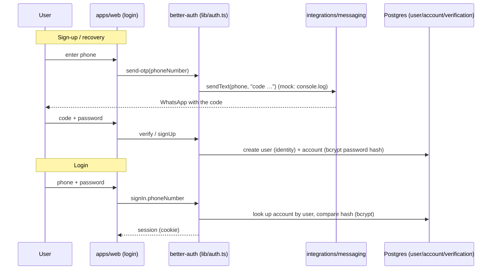

# Flow — phone + OTP authentication

Phone is the primary identifier; email is optional. OTP over WhatsApp (Evolution API in prod; in
dev/mock the code prints to the console). See `stack-arquitetura.md` › Autenticação.

Key points:
- **Identity ≠ credential**: `user` holds who the person is; `account` holds the password (bcrypt
  hash) and future OAuth providers.
- Hashing is **bcrypt** (configured in `lib/auth.ts`), the same used by the seed — which is why the
  seeded user's login works.
- The web layer resolves the session in `lib/auth-context.ts` and builds the `Ctx`. **Dev shortcut**:
  with no session in `development`, it logs in the seeded admin (never in production).
- Email, when present, is an alternative OTP channel and a tax-receipt channel.
