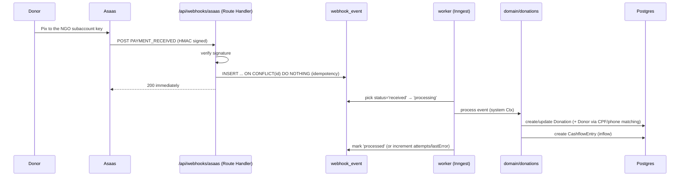

# Flow — automatic donation reconciliation (Pillar 2)

The core selling point: a Pix that lands in the NGO's subaccount becomes a `Donation`
automatically, without the NGO ever opening a bank statement. Schema is ready (`donation`,
`webhook_event`); the domain/UI are future Pillar 2 work. See
`01-docs-referencia/modelagem-dados.md` (WebhookEvent, Donation, Asaas).

Key points:
- **Idempotency by construction**: the PK of `webhook_event` is the Asaas external id; a re-delivery
  does not duplicate.
- **Immediate 200 response**; heavy processing is async (worker), with retry and state in
  `webhook_event`.
- **Donor matching** by CPF, else phone, else create new (no name matching — too many false positives).
- **Fee split** is configured when the Pix charge is created (not stored on the Donation);
  `Donation.amount` is the gross value.
- A donation made to a personal Pix key (outside the subaccount) generates **no** webhook → it isn't
  reconciled (that's why CPF/MEI matters).
