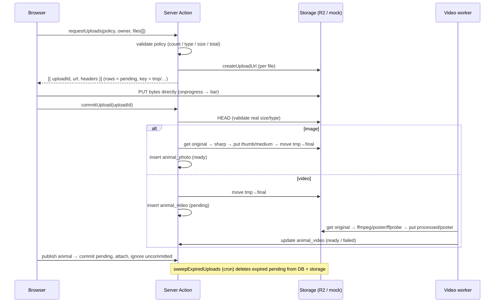

# File uploads

Living document. Design of the reusable file-upload library — how a byte travels
from the browser to storage, how we keep the bucket free of orphans, and how
images and videos get processed. For the layer rules it follows, see
[`architecture.md`](architecture.md).

## Goals

- **Reusable**: one library, many contexts (animal photos, animal videos, and
  later adoption documents, donation receipts…). Each context is a named
  **policy** — allowed types, max files, max size per file, max size per batch.
- **Multi-file** uploads with **per-file progress** feedback.
- **No orphans**: a file uploaded for a registration that is never completed must
  not linger in storage.
- **Mock-first**: works fully offline (local disk) and swaps to Cloudflare R2 in
  production without touching the domain.

## Decisions

| Axis | Choice | Why |
|---|---|---|
| Transport | Browser → storage **directly** via a presigned `PUT`; the server only signs the URL and records the upload | Real progress (`XHR.upload.onprogress`), bypasses the Next body-size limit, no server bandwidth/CPU for the bytes |
| Anti-orphan | Stage in `tmp/{org}/{uploadId}/…` with a `pending` ledger row + `expiresAt`; **commit** promotes to the final prefix; a cron **sweep** deletes expired `pending` | Auditable, works in mock, doesn't depend solely on bucket lifecycle |
| Images | `sharp` **inline at commit** → `thumb`/`medium` → `animal_photo` | Fast enough to run synchronously; deterministic output; identical in mock and R2 |
| Videos | Commit only promotes the original + creates `animal_video` (`pending`); an **async ffmpeg worker** transcodes, extracts a poster, probes duration | Transcoding is slow → must not block the request; the `processingStatus` state machine already exists in the schema |

## Layers

Follows the golden rule — business logic in `packages/domain`, thin web layer,
external effects behind `integrations` interfaces.

```
shared        UploadPolicy (type + Zod), UPLOAD_POLICIES, ID prefix `upl`  — isomorphic
db            generic `upload` ledger table (lifecycle/GC) + existing animal_photo / animal_video
integrations  storage: createUploadUrl / get / move / exists   ·   media: sharp + ffmpeg (server-only)
domain        uploads: requestUploads / commitUpload / processNextVideo / attachAnimalMedia / sweepExpiredUploads
apps/web      requestUploadsAction / commitUploadAction · useUploader hook · <FileDropzone> · media worker runner
```

## End-to-end flow



## The `upload` ledger

A generic table that tracks the **lifecycle** of every uploaded object — it is the
basis for garbage collection. Domain-specific tables (`animal_photo`,
`animal_video`) remain the final, structured destination.

| Column | Notes |
|---|---|
| `pk` / `id` | hybrid IDs; public prefix `upl` |
| `organizationId` | tenant scope (FK to `organization.pk`) |
| `status` | `pending` → `committed` / `failed` |
| `policy` | the `UploadPolicy.key` |
| `storageKey` | `tmp/{org}/{uploadId}/…`, rewritten to the final prefix on commit |
| `contentType`, `sizeBytes`, `originalFilename` | declared on request, re-verified via HEAD at commit |
| `ownerType` / `ownerId` | the entity it belongs to (e.g. `animal` + the draft's public id) |
| `expiresAt` | indexed; the sweep deletes `pending` rows past this |
| `createdAt` / `committedAt` | timestamps |

## Anti-orphan lifecycle

1. Upload is born `pending` under `tmp/{org}/{uploadId}/…` with `expiresAt` (e.g. +24h).
2. Commit re-verifies the real bytes (HEAD), processes, moves to the final prefix, flips to `committed`.
3. `sweepExpiredUploads` (daily cron) deletes `pending` rows past `expiresAt` from **both** the DB and storage.
4. In R2, a lifecycle rule on the `tmp/` prefix is a belt-and-suspenders backstop (mock has none — the sweep is authoritative there).

Because the animal wizard persists **server-side drafts**, files uploaded while
editing carry `owner = { animal, draftId }`. Publishing the animal commits the
pending uploads and attaches them; anything left uncommitted is swept.

## Security (direct upload)

The bytes never pass through our server, so enforcement happens at two points:

- **At request/sign time** — the policy (count, type, per-file and total size) is
  re-validated server-side using the same `uploadBatchSchema` the form uses; the
  presigned URL is locked to the declared `contentType` and a content-length range.
- **At commit time** — a HEAD verifies the *real* size/type, and `sharp`/`ffprobe`
  only succeed on genuinely decodable media. Anything invalid → delete + `failed`.

## Mock vs live

- **mock** (`INTEGRATIONS_MODE=mock`, default): `createUploadUrl` returns a local
  URL; a new `PUT /local-storage/upload/[...key]` route writes under
  `.local-storage/`. `move` is a file rename. ffmpeg/sharp run locally.
- **live**: `createUploadUrl` returns an S3 presigned `PUT` against R2; `move` is
  copy + delete. Same domain code either way.

## Video worker

A DB-polled runner (`pnpm media:worker`; cron in prod) calls `processNextVideo`,
which claims one `pending` video with `SELECT … FOR UPDATE SKIP LOCKED`,
transcodes with ffmpeg, extracts a poster frame, probes duration/format, writes
the derived objects, and advances `processingStatus` to `ready` (or `failed`).
The UI shows a processing state (poster placeholder + spinner) until `ready`.

## Build phases

1. **Contract** — `UploadPolicy` + Zod + `UPLOAD_POLICIES` + ID prefix `upl` (`shared`). ✅ first
2. **Storage** — extend the interface (`createUploadUrl`/`get`/`move`/`exists`); mock + R2 stub; local `PUT` route.
3. **DB** — `upload` table + status enum + migration.
4. **Media** — `processImage` (sharp) + `processVideo` (ffmpeg/ffprobe) in `integrations/media`.
5. **Domain** — `requestUploads` / `commitUpload` / `attachAnimalMedia` / `sweepExpiredUploads`.
6. **Worker** — `processNextVideo` + runner, claim with `SKIP LOCKED`.
7. **Web** — actions + `useUploader` + `<FileDropzone>` (with the video processing state).
8. **Integration** — wire into the photo and video steps of the animal wizard, tied to the draft.
9. **Sweep** — cron script + R2 lifecycle rule.

## Out of scope (for now)

- Resumable / multipart uploads (single `PUT` per file; revisit when files exceed ~200 MB).
- Client-side image compression before upload.
- A generic `attachment` UI beyond animals (the core is generic; consumers land per feature).
